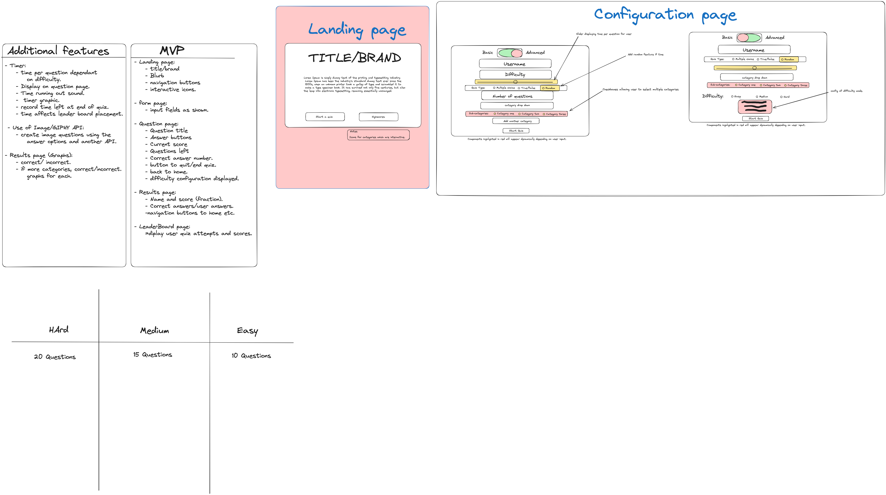

# < ReacTrivia /> Quiz Generator

## Overview
This group project serves to showcase our work in creating an application for users to play trivia games, covering different categories, and track their highscores. 

Our motivation for development was to provide a site offering dynamically generated and engaging quizzes for users to test their trivia knowledge. 

**User Story:**

AS A trivia enthusiast\
I WANT to play quiz games\
SO THAT I can have fun & test my general knowledge

## Features

1. **...:**
   - ...

## Access

To view this project, the deployed site can be found hosted on Netlify at: https://unrivaled-pika-65d12f.netlify.app/

## Installation & Setup

Follow these steps to install and use this application:

1. **Prerequisites:**\
   To use and run this application, ensure that Node.js and npm (as well as Git) are installed locally.
   
3. **Fork & clone this repository:**\
   $ git clone https://github.com/nasinghw/group1p2.git
   
4. **Navigate to the project directory in your terminal:**\
   $ cd group1p2

5. **Install the necessary dependencies:**\
   $ npm install
   
6. **Run the application in development mode in your browser:**\
   $ npm run dev\
   Follow the link: http://localhost:3000/

## Initial Wireframe design

## Collaborators
**Narinder Singh:**
  GitHub: [nasinghw](https://github.com/nasinghw/)
 

**Arfin Tajammal:**
  GitHub: [Arfinxx](https://github.com/Arfinxx/)
 

**Alexander Flaherty:**
  GitHub: [Pazoraf](https://github.com/Pazoraf/)
 

**Roberto Medeiros:**
  GitHub: [rober-web](https://github.com/rober-web/)
 

**Thomas Airey:**
  GitHub: [aireytf](https://github.com/aireytf/)
 

**Udegbunam Chukwuemeka:**
  GitHub: [emeka-egbuna](https://github.com/emeka-egbuna)
 

## Credits 

**Sources referred to during development:**
 - Stack overflow
 - W3Schools
 - MDN Web Docs

# React + Vite

This template provides a minimal setup to get React working in Vite with HMR and some ESLint rules.

Currently, two official plugins are available:

- [@vitejs/plugin-react](https://github.com/vitejs/vite-plugin-react/blob/main/packages/plugin-react/README.md) uses [Babel](https://babeljs.io/) for Fast Refresh
- [@vitejs/plugin-react-swc](https://github.com/vitejs/vite-plugin-react-swc) uses [SWC](https://swc.rs/) for Fast Refresh

